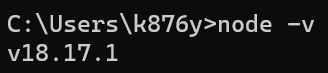

## Requirements

* [Visual Studio Code (VSCode)](https://code.visualstudio.com/download) as the IDE

* [Google chrome](https://www.google.com/chrome/) web browser
* [NodeJS](https://nodejs.org/en/download) 


## Getting Started
*Step 0*
- Make sure you have correctly installed NodeJS and followed all the steps in the installation wizard. Afterwards, you should run the command ```node -v``` to see the current version, which checks if you have Node JS installed correctly. Then you should see something similar to this


Make sure, you are in the backend directory `cd /toothtrek/Website/Backend`

Installs all project dependencies specified in [package.json](./package.json).

```bash
npm install
```

## Start the server with auto-restarts for development

Automatically restarts your server if you save any changes to local files.

```bash
npm run dev
```

## Start the server

```bash
npm start
```
## Debugging with VSCode

1. Set a breakpoint by clicking on the left side of a line number
2. Click *Run > Start Debugging* (Choose the "Debug Server" config if you opened the combined workspace)

> Learn more in the [VSCode Debugging Docs](https://code.visualstudio.com/docs/editor/debugging).