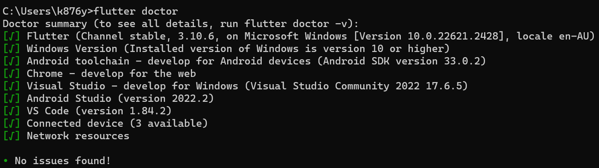
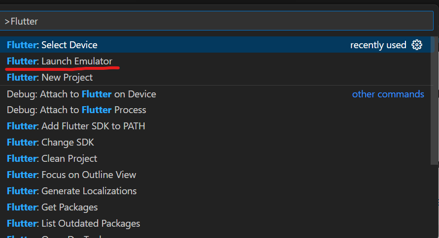
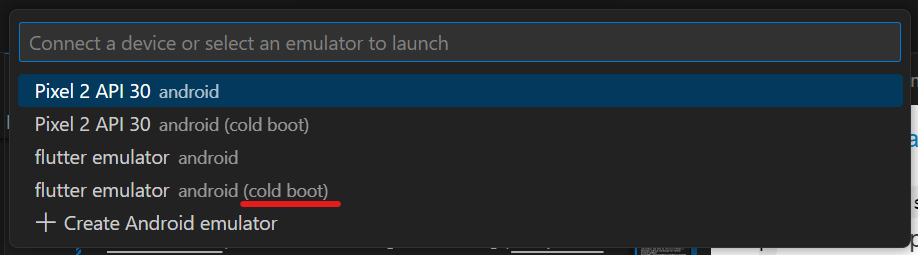

# Client – Vue.js Frontend
## Requirements

* [Visual Studio Code (VSCode)](https://code.visualstudio.com/download) as the IDE
  * [Dart](vscode:extension/Dart-Code.dart-code) plugin for VSCode
  * [Flutter](vscode:extension/Dart-Code.flutter) plugin for VSCode
* [Google chrome](https://www.google.com/chrome/) web browser
* [Flutter](https://docs.flutter.dev/get-started/install) SDK


## Getting Started
*Step 0*
- Make sure you have correctly setup and installed flutter with the SDK. Other wise refer to the flutter [install guide](https://docs.flutter.dev/get-started/install) and make sure to add the bin folder to your enviornment variables. 
By the end of the setup, you should run ```flutter doctor``` and see something similar to this

**Note**: You do __not__ need the Android toolchain or Android studio. They are only reuqired if you want to run the application on an emulator. Otherwise you will just run it on a web browser, namely google chrome

*Step 1*

Clone the repositery into your machine
```
https://github.com/zubairehman/flutter-boilerplate-project.git
```

*Step 2*
Change directory into the folder called "Frontend" inside of "Website" and run the command ```flutter pub get```

*Step 3*
In the same terminal, run the command ```flutter run -d chrome``` to run the application on your web browser.

### Optional
If you want to run the application on an android emulator, then make sure you have [Android studio](https://developer.android.com/studio) and have an [Emulator](https://developer.android.com/design-for-safety/privacy-sandbox/download#:~:text=In%20Android%20Studio%2C%20go%20to,it%20isn't%20already%20installed.) downloaded

Press ```ctrl + shift + p``` on windows or ```cmd + shift + p``` on mac to open the VSCode command pallete 

1. Search "Flutter: Launch Emualtor"
   
2. Select the cold boot option 

3. After the emulator is up, run the command ```flutter run``` in the terminal